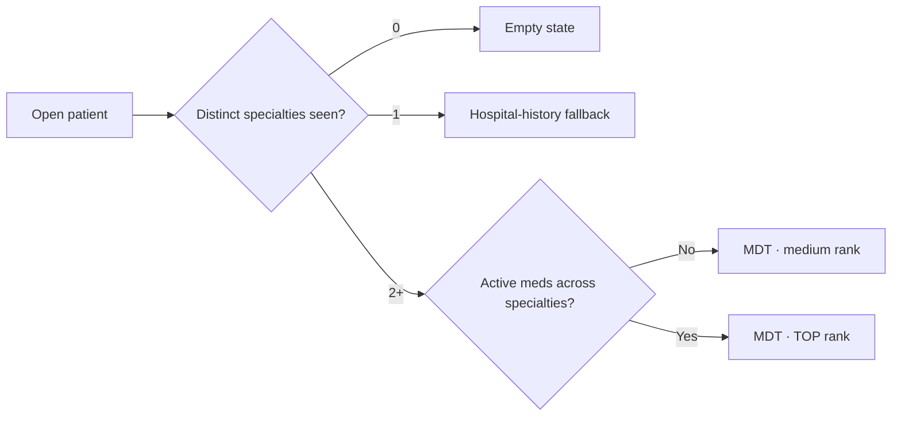
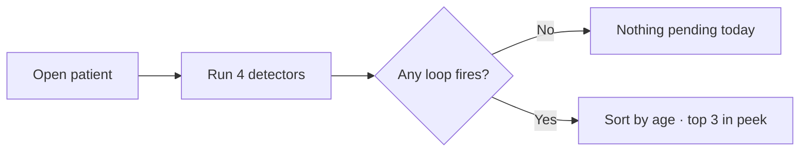
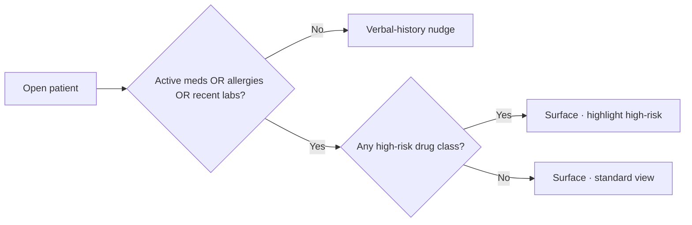
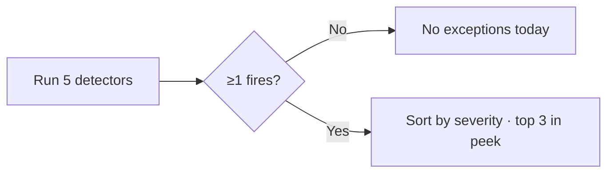
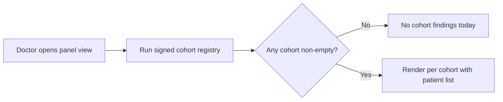

# Velora OS — V0 Intent Spec

> **Pilot · Zydus General Medicine**
> What the doctor sees · what's underneath each card · how every answer is verified.

---

## The setting

```
   ┌──────────────────────────────────────────────────────────────┐
   │                       ZYDUS HOSPITAL                          │
   ├──────────────────────────────────────────────────────────────┤
   │   GenMed   Cardio   Endo   Pulmo   Nephro   ICU   Surgery    │
   ├──────────────────────────────────────────────────────────────┤
   │   notes  ·  prescriptions  ·  labs  ·  pharmacy  ·  billing  │
   │                  ( each in its own silo )                     │
   └──────────────────────────────────────────────────────────────┘
                                 │
                                 ▼
                  ┌──────────────────────────────┐
                  │          VELORA OS            │
                  │   Stitches the silos          │
                  │   MDT-first queries · cited   │
                  └──────────────────────────────┘
```

A patient touches 1, 2, or N specialties over a year. The doctor seeing them today knows only their own slice. **Velora's job is the other slices.**

---

## The three patients a doctor will meet

| | **Type 1** | **Type 2** | **Type 3** |
|---|:---:|:---:|:---:|
| Returning to **this** doctor | ✓ | — | — |
| Known to **this hospital** | ✓ | ✓ | — |
| Hospital data available | Rich | Rich | None |
| Doctor's prior context | Their own notes | Zero | Zero |
| **Velora value** | Augments memory | **Highest leverage ⭐** | Honest empty state |
| First card on welcome | Open loops | **MDT brief** | One-line "no records" |

> Type 1 / 2 / 3 is **engineering taxonomy only**. The doctor never sees it. Velora auto-detects from `patient_id × this_doctor_id × hospital_id` and ranks CTAs accordingly.

---

## The five intents

```
                  ┌──────────────────────────┐
                  │     THE DOCTOR'S DAY      │
                  └────────────┬─────────────┘
                               │
    ┌────────────┬─────────────┼─────────────┬────────────┐
    ▼            ▼             ▼             ▼            ▼
  ① MDT       ② OPEN        ③ ACTIVE       ④ WHY       ⑤ PANEL
    BRIEF       LOOPS          MEDS         FLAGGED      AUDIT
  ⭐ flagship   loose ends    & SAFETY       TODAY       (V0.5)
```

| # | Intent | Doctor's question | Why in V0 |
|---|---|---|---|
| ① | **MDT brief** | *What does each specialty think — and where do they collide?* | Only Velora can answer this · **flagship** |
| ② | **Open loops** | *What did we promise that didn't close?* | Loop-closing safety net |
| ③ | **Active meds & safety** | *Before I prescribe — what conflicts?* | Highest-leverage encounter moment |
| ④ | **Why flagged today** | *Why is this patient on my radar today?* | Concrete event-level alerts |
| ⑤ | **Panel audit** | *Across my panel, what's slipping?* | Cohort surface — V0.5 |

---

## The validation contract

| # | Required on every answer | Why |
|---|---|---|
| 1 | **Source per claim** — visit / Rx / lab / order ID | No fact rests on LLM narrative alone |
| 2 | **Guideline per clinical claim** — body + section | Reproducible reasoning |
| 3 | **Executed query** — Cypher visible on demand | Audit trail |
| 4 | **Data freshness** — last graph sync time | The doctor knows how stale it is |
| 5 | **Exclusion log** — what was filtered, why | No hidden filters |

> **One-sentence rule:** Velora may not state a fact it cannot point to.

---

# ① MDT brief ⭐ FLAGSHIP

> The card a doctor sees first when their patient has been touched by ≥2 specialties.

### When it surfaces

| Scenario | Patient | Behaviour |
|---|:---:|---|
| Seen by 3 specialties · doctor is GenMed | T2 | 🟢 Top-rank MDT card |
| Seen by 2 specialties · both saw them this week | T1 / T2 | 🟢 Top-rank MDT card |
| Documented MDT meeting in last 90 days | T1 / T2 | 🟢 Card includes meeting summary |
| MDT *requested* but never happened | T1 / T2 | 🔴 Surfaced as RED loose end |
| Seen by 1 specialty only | T1 | ⚪ MDT hidden · Hospital history fallback |
| New to hospital · 0 prior visits | T3 | ⚪ Card hidden · empty state shown |

### Suggestion logic



### Response logic

| Step | Source | What's pulled | Validation |
|---|---|---|---|
| 1 | `Visit × Provider` | Specialties involved + last-visit dates | Count = `COUNT(DISTINCT visit_id)` |
| 2 | `Note` metadata | Per-specialty most recent note · header only | Author + specialty + date cited |
| 3 | `Drug Exposure × Provider` | Active meds grouped by prescribing specialty | Each row carries prescriber + start date |
| 4 | DDI rule-base | Cross-team conflicts | Class-level rule cited per flag |
| 5 | `Referral × Visit` | Pending MDT items · unfinished handoffs | Determinism: same query → same result |
| 6 | `Note WHERE type='MDT'` | Last MDT meeting summary if any | Attendees + date only · no free-text |

### Guidelines applied — per specialty

| Specialty's claim | Guideline body cited |
|---|---|
| Cardiology | ACC/AHA · ESC |
| Endocrinology | ADA · KDOQI |
| Pulmonology | GOLD · GINA |
| Nephrology | KDIGO · KDOQI |
| General Medicine | ADA · WHO HTN · NICE NG56 |

> **Critical attribution rule** — every cross-specialty bullet reads *"As documented by Cardiology (Dr Sharma, 24 Apr)..."* — never *"This patient is on apixaban"* without attribution.

### Empty state

> *"Only one specialty has seen this patient. Velora will offer an MDT view once a second specialty is involved."*

---

# ② Open loops

> What was started but never closed — labs without results, referrals without visits, follow-ups missed, prescriptions not filled.

### When it surfaces

| Scenario | Patient | Behaviour |
|---|:---:|---|
| Lab order >7 days old · no result | T1 / T2 | 🟢 Surface as loop |
| Internal referral >30 days · no destination visit | T1 / T2 | 🟢 Surface as loop · MDT-relevant |
| Follow-up booked · `no-show` | T1 / T2 | 🟢 Surface as loop |
| Chronic Rx · no in-hospital fill in 90 days | T1 / T2 | 🟢 Surface as **signal** (not adherence truth) |
| Zero loops detected | any | ⚪ Card hidden · positive empty state |
| New patient | T3 | ⚪ Card hidden |

### Suggestion logic



### Response logic

| Step | Source | What's pulled | Validation |
|---|---|---|---|
| 1 | `Order` | Labs ordered without `result_id` | Window threshold from signed config |
| 2 | `Referral × Visit` | Referral with no destination visit in N days | LEFT JOIN, NULL check |
| 3 | `Appointment` | Status = `no-show` in last N days | Status from EMR, not LLM |
| 4 | `Drug Exposure × Pharmacy Dispense` | Active Rx without fill in 90 days | Disclose: in-hospital pharmacy only |

### Guidelines applied

| Used for | Source |
|---|---|
| "Open" thresholds (7d / 30d / 90d) | **Hospital operational config** · signed off by GenMed lead |
| No clinical guideline | Open-loop detection is operational, not clinical |

### Empty state

> *"Nothing pending for this patient. Last verified <timestamp>."*

---

# ③ Active meds & safety

> Active medications, allergies, recent labs — and what conflicts with what the doctor is about to do.

### When it surfaces

| Scenario | Patient | Behaviour |
|---|:---:|---|
| Patient on any active med | T1 / T2 | 🟢 Surface |
| Patient has allergies on file | T1 / T2 | 🟢 Surface · allergies prominent |
| Lab in last 30 days exists | T1 / T2 | 🟢 Surface · recent labs visible |
| High-risk class (anticoag / immunosup / opioid) | T1 / T2 | 🔴 Surface with priority |
| Same-class lab ordered <30 days ago | T1 / T2 | 🟡 Flag duplicate-order risk |
| New patient · zero record | T3 | ⚪ Card replaced with verbal-history nudge |

### Suggestion logic



### Response logic

| Step | Source | What's pulled | Validation |
|---|---|---|---|
| 1 | `Drug Exposure` (active) | Drug · dose · prescriber · specialty · start date | Active = no stop date OR `stop_date > today()` |
| 2 | `Observation` (allergy) | Allergies on file | Source: structured allergy entries only |
| 3 | DDI rule-base | Pairwise interactions across active list | Class-level rule id cited per flag |
| 4 | `Measurement` (last 30d) | Recent labs by category, vs threshold | Threshold from signed config · LLM may not interpret |
| 5 | `Order` (last 30d) | Same-class orders · "don't re-order" hint | Display, not recommendation |

### Guidelines applied

| Used for | Source |
|---|---|
| DDI flagging | **Zydus Pharmacy Formulary** + **Lexicomp** class rules |
| Threshold colouring | **ADA 2024** (HbA1c) · **WHO HTN 2023** (BP) · **NICE NG56** (polypharmacy) |
| Safe-prescribing baseline | **WHO Essential Medicines List** |

### Empty state

> *"No active medications, allergies, or recent labs at this hospital. Verify verbally before prescribing."*

---

# ④ Why flagged today

> Concrete reasons this specific patient surfaced on the doctor's morning radar.

### When it surfaces

| Scenario | Patient | Behaviour |
|---|:---:|---|
| Recent admission (last 30d) | T1 / T2 | 🔴 High-priority flag |
| Critical lab unreviewed | T1 / T2 | 🔴 High-priority flag |
| Vital exceeds signed threshold | T1 / T2 | 🟡 Warning flag |
| Polypharmacy ≥5 chronic meds for ≥90d | T1 / T2 | 🟡 Warning flag |
| Missed follow-up in last 30d | T1 / T2 | 🟡 Warning flag |
| No triggers fire | any | ⚪ "No exceptions today" |
| New patient | T3 | ⚪ "First-time patient · allow extra time" |

### Suggestion logic



### Response logic

| Step | Source | What's pulled | Validation |
|---|---|---|---|
| 1 | `Visit` (admission) | Last admission in 30d · discharge summary header | Source: structured event |
| 2 | `Measurement` (critical) | Critical-flagged labs · unreviewed | "Unreviewed" = no subsequent visit-tied note |
| 3 | `Vital` | Last reading vs signed threshold | Threshold cites guideline section |
| 4 | `Drug Exposure` count | Distinct chronic meds × 90d | Polypharmacy from NICE NG56 |
| 5 | `Appointment` | Missed in last 30d | Status from EMR |

### Guidelines applied

| Threshold | Guideline cited |
|---|---|
| HbA1c >9% | ADA 2024 |
| BP ≥150 sustained | WHO HTN 2023 |
| ≥5 chronic meds for 90d | NICE NG56 |
| Critical K+ / Na+ / Hb cut-offs | Hospital lab reference range (signed) |

> **Severity is structured-rule output only.** The LLM may not classify a flag as critical / warning / neutral.

### Empty state

> *"No exceptions today. Velora checked at <timestamp>."*

---

# ⑤ Panel audit *(V0.5+ surface)*

> Across the doctor's whole panel — what's drifting, who's slipping, where the cohort needs attention.

### When it surfaces

| Scenario | Patient scope | Behaviour |
|---|:---:|---|
| Daily / weekly digest opened | All T1 + T2 on panel | 🟢 Cohort findings rendered |
| Doctor opens "My panel" view | All T1 + T2 on panel | 🟢 Cohort findings rendered |
| Inside per-patient view | n/a | ⚪ Not surfaced — separate surface |

### Suggestion logic



### Response logic

| Step | Source | What's pulled | Validation |
|---|---|---|---|
| 1 | Cohort registry | Patients matching each signed definition | Determinism: same patient × same data → same list |
| 2 | Per-patient qualifier | The data point that put them in the cohort | Cited in row (e.g., HbA1c value + date) |
| 3 | Audit footer | Cohort registry version + signing date | Reproducible across runs |

### Guidelines applied

| Cohort | Guideline body |
|---|---|
| T2DM uncontrolled (HbA1c >9%) | ADA 2024 |
| Hypertensive uncontrolled (mean SBP >140) | WHO HTN 2023 |
| Polypharmacy (≥5 chronic meds 90d) | NICE NG56 |
| eGFR <60 not yet referred to Nephro | KDIGO 2024 |

### Empty state

> *"No cohort findings. Velora ran <N> cohort definitions; all returned zero or are within target."*

---

## Failure modes — when Velora must say less

| Situation | Required behaviour |
|---|---|
| Type 3 patient · zero data | One-line empty state · zero CTAs · "Begin a fresh history" |
| Partial data (e.g., no labs in 30d) | Render available cards only · each peek discloses what's missing |
| Pharmacy data is in-hospital only | Mandatory disclosure on any adherence claim |
| Cypher returns >200 rows | Render with "Showing top 200 of N" — never silently truncate |
| Cypher times out (>5s) | Error envelope · no partial answer |
| LLM disagrees with structured rule | Structured rule wins · LLM may not override |
| Two values for same lab | Render both with timestamps · Velora doesn't pick |
| Question outside the 5 intents | "I'm not sure how to help with that" + 4 example prompts |
| Graph stale (> threshold) | Freshness warning banner · Today's flags hidden, not stale |

---

## Guidelines configured for V0 General Medicine

### The three on the input footer (visible to doctor)

| Guideline | Used for | Version |
|---|---|---|
| **ADA Standards of Care** | Diabetes thresholds & cadence | 2024 |
| **WHO HEARTS Hypertension** | BP thresholds | 2023 |
| **NICE NG56** | Polypharmacy & medication review | 2017 (active) |

### Auxiliary references (used by engine, not in chip)

| Reference | Used for |
|---|---|
| Zydus Pharmacy Formulary | DDI flagging baseline |
| Lexicomp class-level rules | DDI second tier |
| WHO Essential Medicines List | Safe-prescribing baseline |
| KDIGO 2024 | eGFR / Nephro referral cohort |

### MDT brief — multi-guideline grid

When MDT brief renders a cross-team view, each specialty's claim is cited against that specialty's guideline body — see Intent ① guidelines table above. The footer chip continues to show **GenMed's three** (the doctor's own specialty); per-bullet citations name the others.

---

## How the chat UI maps to this spec

| UI element (doctor sees) | What it means in this spec |
|---|---|
| Patient chip in header (`name · 58M · MRN · OPD`) | Patient context · type taxonomy NOT shown |
| **CTA #1 — MDT brief** | Intent ① · ranked first when ≥2 specialties seen |
| **CTA #2 — Pending & unresolved** | Intent ② · only renders if ≥1 loop fires |
| **CTA #3 — Active meds & safety** | Intent ③ · always renders if any active med / lab |
| **CTA #4 — Why flagged today** | Intent ④ · only renders if ≥1 trigger fires |
| Suggestion pills above input | Lower-rank follow-ups · same provenance contract |
| Footer chips: ADA · WHO HTN · NICE NG56 | Active GenMed guideline anchors |
| Trust strip (records · sources · query · sync) | Validation contract made permanently visible |
| Audit footer per answer (when responses render) | Per-answer evidence tier · row count · duration · freshness · Show Cypher |

> When all four intents are empty (typical Type 3 first-time visitor): one line — *"No prior records. Begin a fresh history."* — plus the input. The empty state IS the trust state.

---

## Open questions before pilot launch

| Question | Owner | Deadline |
|---|---|---|
| Which DDI rule-base — Zydus formulary, Lexicomp, or both? | Zydus pharmacy + Zyvelor eng | Pre-Day-1 |
| "Doctor's panel" = attending of record OR last encounter ≤90d? | Zydus clinical lead | Pre-Day-1 |
| Open-loop windows (7 / 30 / 90 days) — clinically right? | Zydus clinical lead | Pre-Day-1 |
| MDT meeting marker — how is it stored in Zydus EMR? | Zydus IT | Pre-Day-1 |
| Daily refresh cadence for "Today's flags" — overnight, every 4h, near-live? | Zydus IT + Zyvelor eng | Pre-Day-1 |
| Are ADA · WHO HTN · NICE NG56 the right three for Indian context, or substitute ICMR? | Zydus clinical lead | Pre-Day-1 |
| Cross-specialty attribution wording — "As documented by Cardio" vs "Cardio note 24 Apr"? | Zyvelor design + clinical lead | Day 1 design |

---

*Living spec. Re-version on every signed rule change. The intent layer is the contract between Velora and the doctor — if it drifts, trust drifts.*

**2026-05-08 · Zyvelor Labs**
